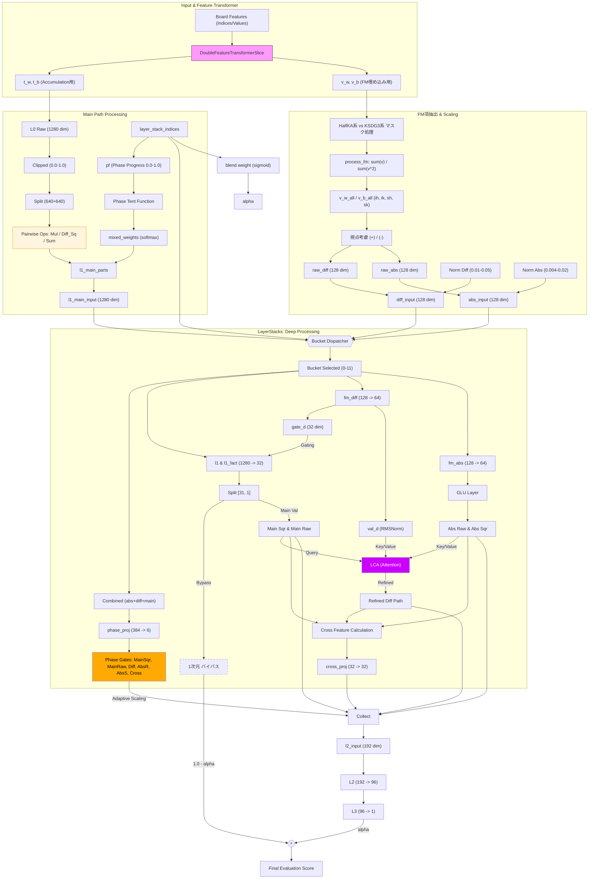

# HalfKA-KSDG3_FM_1280

- 「HalfKA-KSDG3_FM_1280」はやねうら王の「SFNNwoPSQT-1536 NNUE アーキテクチャ」を元にして、FM（Factorization Machines）的な考え方を取り入れたものです。
  - C++側（やねうら王）：https://github.com/tttak/YaneuraOu/tree/HalfKA-KSDG3_FM_1280
  - python側（nnue-pytorch）：https://github.com/tttak/nnue-pytorch/tree/HalfKA-KSDG3_FM_1280

- FM的な考え方を取り入れるアイデアやプログラム作成（python側、C++側の両方）等について、多くの部分をGemini等（Gemini、Copilot、ChatGPT）にお手伝い頂きました。
- C++側はとりあえずは処理速度はあまり考慮していません。たぶん高速化の余地は色々とあると思います。
- 棋力的には特に強くなっていません。NPSは水匠11αの約3分の1で、ノード数固定で対局すると水匠11αと同程度、同じ持ち時間で対局すると水匠11αへの勝率20%くらいで大幅に負け越します。
- 以下のプログラムを元にして作成しました。
  - やねうら王：https://github.com/yaneurao/YaneuraOu/tree/e4589706b973847b5db834bd449122a71d72b565 （やねうら王本家）
  - nnue-pytorch：https://github.com/saihyou/nnue-pytorch/tree/7c8a0a02c42cc02a72cd2d206753430ef54f9da5 （saihyouさんのリポジトリのfeature/feature_transformerブランチ）

- NNUE評価関数の入力特徴量はHalfKPやHalfKAのように「玉と他の駒」の形が多いと思います。  
  そこで、NNUE以前の「2駒関係（KP-PPなど）」や「3駒関係（KPPTなど）」のように、「玉以外の駒同士」の関係をNNUEにもっと直接的に取り入れてみたいと考えていたのですが、  
  「[HalfKP-PP](https://github.com/tttak/YaneuraOu/releases/tag/V4.89_NNUE-features_20200401)」のように特徴量に直接PPを追加する方法だと処理速度が非常に遅くなり、うまくいかないようでした。  

- 今回の「HalfKA-KSDG3_FM_1280」では、FeatureTransformerの部分に「203670（特徴量の次元数） * 32」個のweight（Vベクトル）を追加し、  
  評価値計算の際には当該局面の特徴量に基づき「SumV = sum(weight)」と「SumV2 = sum(weight^2)」を算出し、  
  さらに「Inter = (SumV^2 - SumV2) / 2」を算出し、これをNetwork（LayerStacks）の入力に加える形にしました。  
  簡単のため変数2個だけで考えると「Inter = ((a+b)^2 - (a^2+b^2)) / 2 = ab」ということでaとbの積の形になるので  
  間接的に駒同士の相互作用が算出されたことになるとのことでした。（これがFM（Factorization Machines）的な考え方とのこと）

- 今回の入力特徴量は「HalfKAとKSDG3（KingSafety3_DistinguishGolds）」にしているのですが、  
  上記FM項の部分もHalfKA部分とKSDG3部分に分けて算出し、  
  さらにその各々について  
  　diff_Inter = 自分視点のInter - 相手視点のInter  
  　diff_SumV  = 自分視点のSumV  - 相手視点のSumV  
  　abs_Inter  = 自分視点のInter + 相手視点のInter  
  　abs_SumV   = 自分視点のSumV  + 相手視点のSumV  
  を算出して、Networkへのinputにしました。

- Networkへのinputは以下のようになります。
  - Main（従来からのFeatureTransformerのoutput）：1280次元
  - Diff：128次元
  - Abs：128次元

- Network（LayerStacks）側もGemini等のアイデアを受け、色々詰込みました。（実装も大部分をGemini等にして頂きました）  
  - Mainパス
    - L1で1280次元から32次元に変換
    - 31次元は下記Diffゲートの後、その31次元自体とそれを2乗したものをL2へ
    - 1次元は直接L3へ（バイパス）

  - Diffパス
    - L1で128次元から64次元に変換
    - 前半32次元はMainパスのGateとして使用
    - 後半32次元は以下を適用した後、L2へ
      - RMSNormを適用
      - 簡易的なLCA（Lightweight Cross-Attention）を適用
        - Query：Mainパスの31次元を使用
        - Key：Diffの32次元とAbsの32次元を使用
        - Value：Keyと同じ

  - Absパス
    - L1で128次元から64次元に変換
    - GLU（Gated Linear Unit）：前半32次元を後半32次元のGateとして使用
    - 上記Gate適用後の後半32次元と、それを2乗したものをL2へ

  - Cross Feature：異種パス間の積による相関特徴
    - 以下をあわせてL2へ
      - 「Mainパスの2乗部分の中の16次元」と「Diffパスの中の16次元」を掛け算
      - 「Mainパスの中の16次元」と「Absパスの中の16次元」を掛け算

  - 以上で作成された下記192次元のうちPad以外の6種類について、Phase Gateでスケール調整（Phase Gateの値自体も学習させる）
    - MainSqr：31次元
    - MainRaw：31次元
    - Diff：32次元
    - AbsRaw：32次元
    - AbsSqr：32次元
    - Cross：32次元
    - Pad：2次元（次元の合計を32の倍数にするために0をパディング）

  - スケール調整後の192次元をL2で96次元に変換
  - L3で96次元を1次元に変換
  - 「L3のoutputの1次元」と上記「Mainからバイパスの1次元」をブレンドして評価値として返す
    - ブレンド係数も学習させる

- LayerStacksは12個にして、「当該局面の駒割りの差の絶対値」で0～11に分類しました。  
  （この分け方についてそれほど根拠はありません。NNUEの評価値も大雑把に見れば駒割りの評価値付近にあることが多いと思うので、各々のLayerStackが各評価値帯で専門分化してくれれば、くらいに思っています）  
  【2026/8/11追記】LayerStacksの分類も学習させるように変更しました。（FT層では「駒割りの差の絶対値」を使い、FC層ではrouterの学習結果を使う）

- FeatureTransformerのMainの部分も多少変更しました。  
  「SFNNwoPSQT-1536」等でUSE_ELEMENT_WISE_MULTIPLYを有効にした場合、  
  例えばL1が1280次元の場合は640個の要素ごとの積を計算していると思いますが、  
  今回は積だけではなく「積、差の2乗、和/2」の3つを計算して、それをブレンドするようにしました。  
  ブレンド係数は「4（序盤、中盤1、中盤2、終盤の4種類） * 640（上記要素数） * 3（積、差の2乗、和/2の3種類）」個のパラメータにして学習させました。  
  （正確には「4」の部分は「序盤、中盤1、中盤2、終盤」ではなく上記のLayerStacksの0～11をもとにテント関数で算出）
  - ちなみに、Genini等によるとStockfishや「SFNNwoPSQT-1536」等で要素ごとの積を計算している時点で（FMとはまた別のところで）「駒同士の相互作用」が計算されていることになるとのことでした。  
    （今回でいえば）203670次元から1280次元への変換後に積を計算しているので入力特徴量自体の積ではないのですが、間接的に「駒同士の相互作用」ということになるとのことでした。

- 特徴量の中の「KSDG3」は下記リンク先の「KingSafety Distinguish Golds」と概ね同じですが、  
  玉の24近傍のうち盤外は特徴量に含めないようにしました。  
  （なので局面ごとの特徴量の数は一定ではなく、玉の位置によって8個～24個に変わります）  
  https://github.com/tttak/YaneuraOu/releases/tag/V4.89_NNUE-features_20200406

- 今回はC++側（YaneuraOu側）はあまりきちんと整合をとった改修はしておらず、  
  AVX2用の実行ファイルは問題なく動くと思いますが、  
  例えばSSE42用の実行ファイルはSSE42環境では動作しないかもしれません。

- pytorchでの学習時の引数をいくつか追加しました。  
  例：
  ```
  python train.py --offset1 270 --offset2 270 --in-scaling 340 --out-scaling 380 --batch-size 16384 --threads 2 --num-workers 8 --gpus 1 --log_every_n_steps 50 --features="HalfKA_KSDG3" --lr=1e-4 --start-lambda 1.0 --end-lambda 1.0 --max_epochs 3000 --epoch-size 50000000 --network-save-period 5 --seed 100 --mirror 0.05 --train1-rate 0.50 --train2-rate 0.30 --skiprate 3.0 C:\xxx\train1.bin C:\xxx\train2.bin C:\xxx\train3.bin C:\xxx\validation.bin
  ```
  - --offset1、--offset2：元々の--offsetを現在のネットからの出力用（--offset1）と教師局面用（--offset2）の2つに分けました。（たぶんあまり意味はないです）
  - --mirror：教師局面の左右反転率。例えば「--mirror 0.05」の場合、教師局面の5%を左右反転して使います。
  - --train1-rate、--train2-rate：教師局面のbinファイルを3つ指定し、各々の割合を指定します。例えば「--train1-rate 0.50 --train2-rate 0.30」の場合、train1.binから50%、train2.binから30%、train3.binから20%の局面が使われます。
  - --skiprate：例えば「--skiprate 3.0」の場合、教師局面をバッチサイズの3倍読み込んだうえで、バッチサイズ分をランダムに選んで使います。

- 学習時に500ステップごとに色々とログ出力するようにしました。（下記「学習ログの例」参照）
  - これも大部分のコードをGemini等に作成して頂きました。
  - ログをそのまま貼り付けるだけでGemini等が様々なアドバイスをしてくれると思います。
  - 例えば、ゼロからの学習時にはログの「G_Ratio」がかなり小さな値になると思います。  
    これは今回追加したFM部に勾配が流れていっていないことを意味するのですが、G_Ratio向上のために初期値変更や係数変更、部分的な学習率の変更やネットワークの構造変更など、色々なアドバイスを頂きました。  
    最初の1～2epochだけself.input.weightとself.input.biasの学習率をゼロにして強制的にself.input.vの方に勾配を流し、その後通常に戻す方法が一番効果があったかもしれません。
  - TensorBoardに出力する情報もいくつか追加しました。
    - DiffとAbsのGate率の推移
    - 上記「積、差の2乗、和/2」の混合率の推移
    - 学習率の推移
    - lambda（評価値と勝敗の混合率）の値を仮に0.0, 0.5, 1.0等にしたときのval_lossの推移（実際のlambdaの値とは関係なく）

- pytorch側に擬似的なPairwise LossとListwise Lossを追加しました。
  - 駒割りが近い2局面の評価値の大小関係を教師データに合わせるように学習
  - 駒割りが近い2局面の評価値の差を教師データに近づけるように学習
  - 駒割りが近い6局面の評価値の順位分布を教師データに合わせるように学習

- 学習コマンドの例（nnue-pytorch）
  ```
  # ゼロから学習
  python train.py --offset1 270 --offset2 270 --in-scaling 340 --out-scaling 380 --batch-size 16384 --threads 2 --num-workers 8 --gpus 1 --log_every_n_steps 50 --features="HalfKA_KSDG3" --lr=1e-4 --start-lambda 1.0 --end-lambda 1.0 --max_epochs 3000 --epoch-size 50000000 --network-save-period 5 --seed 100 --mirror 0.05 --train1-rate 0.50 --train2-rate 0.30 --skiprate 3.0 C:\xxx\train1.bin C:\xxx\train2.bin C:\xxx\train3.bin C:\xxx\validation.bin

  # ckptから学習再開
  python train.py --resume-from-model logs\lightning_logs\version_5\100.ckpt --offset1 270 --offset2 270 --in-scaling 340 --out-scaling 380 --batch-size 16384 --threads 2 --num-workers 8 --gpus 1 --log_every_n_steps 50 --features="HalfKA_KSDG3" --lr=1e-4 --start-lambda 1.0 --end-lambda 1.0 --max_epochs 3000 --epoch-size 50000000 --network-save-period 5 --seed 100 --mirror 0.05 --train1-rate 0.50 --train2-rate 0.30 --skiprate 3.0 C:\xxx\train1.bin C:\xxx\train2.bin C:\xxx\train3.bin C:\xxx\validation.bin

  # ptから学習再開
  python train.py --resume-from-model C:\yyy\nn.pt --offset1 270 --offset2 270 --in-scaling 340 --out-scaling 380 --batch-size 16384 --threads 2 --num-workers 8 --gpus 1 --log_every_n_steps 50 --features="HalfKA_KSDG3" --lr=1e-4 --start-lambda 1.0 --end-lambda 1.0 --max_epochs 3000 --epoch-size 50000000 --network-save-period 5 --seed 100 --mirror 0.05 --train1-rate 0.50 --train2-rate 0.30 --skiprate 3.0 C:\xxx\train1.bin C:\xxx\train2.bin C:\xxx\train3.bin C:\xxx\validation.bin

  # 「--features="HalfKA_KSDG3^"」で学習する場合
  python train.py --offset1 270 --offset2 270 --in-scaling 340 --out-scaling 380 --batch-size 16384 --threads 2 --num-workers 8 --gpus 1 --log_every_n_steps 50 --features="HalfKA_KSDG3^" --lr=1e-4 --start-lambda 1.0 --end-lambda 1.0 --max_epochs 3000 --epoch-size 50000000 --network-save-period 5 --seed 100 --mirror 0.05 --train1-rate 0.50 --train2-rate 0.30 --skiprate 3.0 C:\xxx\train1.bin C:\xxx\train2.bin C:\xxx\train3.bin C:\xxx\validation.bin

  # nn.nnue（nn.bin）作成
  python serialize.py --ft_compression none logs\lightning_logs\version_0\5.ckpt C:\yyy\nn.nnue --features="HalfKA_KSDG3"

  # nn.nnue（nn.bin）作成（「--features="HalfKA_KSDG3^"」で学習した場合）
  python serialize.py --ft_compression none logs\lightning_logs\version_0\5.ckpt C:\yyy\nn.nnue --features="HalfKA_KSDG3^"

  # pt作成
  python serialize.py --ft_compression none C:\yyy\nn.nnue C:\yyy\nn.pt --features="HalfKA_KSDG3"

  # 評価値計算のC++/pytorchのトレース比較用
  python trace_nnue.py --checkpoint logs\lightning_logs\version_xxx\xxx.ckpt --trace trace.tsv

  # tensorboard起動
  tensorboard --logdir=lightning_logs/
  ```

- ビルドコマンドの例（YaneuraOu）
  ```
  # 通常
  make -j8 tournament TARGET_CPU=AVX2 COMPILER=clang++ YANEURAOU_EDITION=YANEURAOU_ENGINE_NNUE_SFNNwoP1536 EXTRA_CPPFLAGS="-DUSE_ELEMENT_WISE_MULTIPLY"

  # 評価値計算のC++/pytorchのトレース比較用
  make -j8 tournament TARGET_CPU=AVX2 COMPILER=clang++ YANEURAOU_EDITION=YANEURAOU_ENGINE_NNUE_SFNNwoP1536 EXTRA_CPPFLAGS="-DUSE_ELEMENT_WISE_MULTIPLY -DENABLE_NNUE_TRACE"
  ```

- 追加コマンドの例（YaneuraOu）（isreadyの後に実行）
  ```
  # 評価関数の基本情報を出力
  test nnue info

  # 特徴量の差分計算のテスト
  test nnue test_features

  # Accumulatorの差分計算のテスト
  test nnue test_accumulator

  # move accuracyの測定
  test nnue accuracy xxx.bin

  # 評価値計算のC++/pytorchのトレース比較用
  test nnue trace_full trace.tsv l5knl/3g5/p1n1pgs2/1rpp3pp/Pp2S1p2/2S5P/1P1PP1N2/1KG2G3/LN5+rL b BSPb4p 61

  test nnue trace l5knl/3g5/p1n1pgs2/1rpp3pp/Pp2S1p2/2S5P/1P1PP1N2/1KG2G3/LN5+rL b BSPb4p 61
  ```

- その他
  - GPUメモリ節約と学習速度向上のためオプティマイザにはAdamW8bitを使用していますが、たぶんその分精度は落ちていると思います。
  - 教師局面を事前にqsearchでフィルタするのが面倒なときのために、簡易的に「手番側が相手側の駒（ただし歩と香と桂を除く）をただで取れる局面」の場合はスキップするようにしていますが、たぶん素直にqsearchでフィルタした方がよいと思います。
  - 【2026/8/11追記】pytorch側に「積、差の2乗、和/2」のdropout、EMA蒸留、Bucket蒸留などを追加しました。

- HalfKA-KSDG3_FM_1280 アーキテクチャ図（Gemini作成）



- 学習ログの例
```
[FM Detailed Debug Step 294000]
 Features   | ActiveAvg: 55.8, Unique:49351
 LayerStacks Entry Analysis
   MainPath | mean: 0.0395, std: 0.0802, min: 0.0000, max: 0.8941
   FM Diff  | mean: 0.5004, std: 0.0705, min: 0.0000, max: 1.0000
   FM Abs   | mean: 0.4981, std: 0.0487, min: 0.2421, max: 0.8165
 Output Composition | L3(Deep):  0.9991 (73.9%) | MainBypass:  0.3523 (26.1%)
 Final Score Range  | Min:   -5.43, Max:    8.34, Mean:   -0.04
 Blend Alpha (DeepPath Ratio):
   Mean : 54.98%
   Min  : 53.18%
   Max  : 56.73%
--------------------------------------------------------------------------------------------------------------
FM Component        | Raw min / mean  / max    / std    |   Zero% |   High%
--------------------------------------------------------------------------------------------------------------
 Inter HalfKA(Diff) |  0.232 /  0.500 /  0.773 /  0.019 |   0.00% |   0.00%
 Inter HalfKA(Abs)  |  0.497 /  0.504 /  0.610 /  0.008 |   0.00% |   0.00%
 Inter KSDG3(Diff)  |  0.000 /  0.502 /  1.000 /  0.074 |   0.03% |   0.04%
 Inter KSDG3(Abs)   |  0.495 /  0.530 /  0.817 /  0.033 |   0.00% |   0.00%
 SumV HalfKA(Diff)  |  0.091 /  0.500 /  0.919 /  0.073 |   0.00% |   0.00%
 SumV HalfKA(Abs)   |  0.389 /  0.512 /  0.651 /  0.027 |   0.00% |   0.00%
 SumV KSDG3(Diff)   |  0.000 /  0.499 /  1.000 /  0.093 |   0.01% |   0.01%
 SumV KSDG3(Abs)    |  0.242 /  0.446 /  0.687 /  0.060 |   0.00% |   0.00%
-------------------------------------------------------------------------------------------------------------------
Component                              |    Min /   Mean /    Max /    Std
-------------------------------------------------------------------------------------------------------------------
 FM Diff (RMSNormed, before scaling)   |  -2.63 /  -0.30 /   2.77 /   0.95
 FM Abs  (Gated, before scaling)       | -12.56 /  -8.21 /   1.28 /   3.73
--------------------------------------------------------------------------------------------------------------
[Signal Strength (L2 Input)]
 L2 In | Main(Sqr): 0.1467 | Main(Raw): 0.2509 | FM(Diff): 0.1740 | FM(Abs): 0.0649  | cross_feat: 0.0629
--------------------------------------------------------------------------------------------------------------
Section      |    Mean | AbsMean |     Std |     Max |     Min |   Zero% |   High%
--------------------------------------------------------------------------------------------------------------
Main(Sqr)    |   0.147 |   0.147 |   0.249 |    1.00 |    0.00 |   48.3% |    2.3%
Main(Raw)    |   0.251 |   0.251 |   0.307 |    1.00 |    0.00 |   40.7% |    5.9%
FM(Diff)     |   0.174 |   0.174 |   0.211 |    1.00 |    0.00 |   24.4% |    0.0%
FM(Abs_Raw)  |   0.077 |   0.077 |   0.078 |    0.46 |    0.00 |   18.2% |    0.0%
FM(Abs_Sqr)  |   0.053 |   0.053 |   0.081 |    0.39 |    0.00 |   50.0% |    0.0%
cross_feat   |   0.063 |   0.063 |   0.118 |    1.00 |    0.00 |   61.2% |    0.0%
[Gradient] MeanAbs_V:2.77e-09, MeanAbs_M:1.13e-07, G_Ratio:  0.0244
[Weights]  Diff_W: 12.71, Abs_W: 34.04, L2_W: 42.38
------------------------------------------------------------------------------------------------------------------------
Layer Name         | Grad Mean    Active   | W_Mean   W_Min    W_Max     W_Std   | B_Mean   B_Min    B_Max     B_Std
------------------------------------------------------------------------------------------------------------------------
W_input (All)      | 0.0000009081 41352424 | -0.00020 -1.61586 +1.06952  0.03922 | -0.15245 -0.56167 +0.51706  0.13786
W_KSDG3 (Part)     | 0.0000019708 3480373  | -0.00446 -1.61586 +1.06952  0.04981 | -0.15245 -0.56167 +0.51706  0.13786
W_HalfKA (Part)    | 0.0000007897 37872051 | +0.00008 -1.44323 +1.05948  0.03840 | -0.15245 -0.56167 +0.51706  0.13786
V_Factor (FM)      | 0.0000000205 2116058  | -0.00007 -0.66953 +0.56800  0.01052 | +0.00000 +0.00000 +0.00000  0.00000
Pair_W (Raw)       | 0.0000026165 7548     | -0.01500 -1.25094 +1.55261  0.25994 | +0.00000 +0.00000 +0.00000  0.00000
L1_Main (Linear)   | 0.0000048044 478176   | +0.00200 -0.93980 +0.56374  0.06329 | +0.05398 -0.16151 +0.21460  0.05766
L1_Fact            | 0.0000178151 40109    | -0.00404 -0.82271 +0.66561  0.07058 | +0.05923 -0.07742 +0.20787  0.06369
L1_Combined (Sum)  | 0.0000198331 481308   | -0.00204 -1.37012 +1.15386  0.12136 | +0.11321 -0.23893 +0.39157  0.11187
FM_Diff_Path       | 0.0000017210 98304    | -0.01608 -0.23513 +0.12317  0.03721 | -0.01626 -0.17923 +0.13351  0.04363
FM_Abs_Path        | 0.0000001555 98048    | -0.03720 -0.24059 +0.08539  0.10200 | -0.04682 -0.29715 +0.12821  0.15286
cross_proj         | 0.0000079971 11854    | -0.01026 -0.92442 +0.77456  0.16873 | -0.01069 -0.35041 +0.11970  0.05869
q_proj             | 0.0000049599 992      | +0.02743 -0.52689 +0.50340  0.14066 | -0.02340 -0.19049 +0.12178  0.09007
k_proj             | 0.0000015678 2048     | +0.02721 -0.22065 +0.30735  0.09260 | +0.02568 -0.16455 +0.24288  0.09698
v_proj             | 0.0000054779 384      | -0.02704 -0.25361 +0.21538  0.08941 | -0.03560 -0.21739 +0.19459  0.10986
phase_proj         | 0.0000086661 2280     | -0.00604 -0.82729 +1.00056  0.20558 | -0.01981 -0.05984 +0.01022  0.02586
L2_Weight (Sum)    | 0.0000035525 192463   | +0.00049 -1.03299 +0.80684  0.09012 | +0.02342 -0.12144 +0.21986  0.04798
Output_Weight      | 0.0000359541 1028     | +0.01923 -1.67988 +1.16416  0.29117 | -0.00795 -0.02483 +0.00699  0.00947
P_Open_Mul         | 0.0000032890 628      | +0.40015 +0.10675 +0.51972  0.06762 | +0.00000 +0.00000 +0.00000  0.00000
P_Open_Diff        | 0.0000025670 628      | +0.34682 +0.24398 +0.80363  0.06558 | +0.00000 +0.00000 +0.00000  0.00000
P_Open_Sum         | 0.0000017778 628      | +0.25303 +0.08962 +0.39579  0.04401 | +0.00000 +0.00000 +0.00000  0.00000
P_Mid1_Mul         | 0.0000036727 628      | +0.41416 +0.06858 +0.53159  0.07431 | +0.00000 +0.00000 +0.00000  0.00000
P_Mid1_Diff        | 0.0000028608 628      | +0.32524 +0.22699 +0.87619  0.06934 | +0.00000 +0.00000 +0.00000  0.00000
P_Mid1_Sum         | 0.0000021861 628      | +0.26060 +0.05523 +0.44483  0.04708 | +0.00000 +0.00000 +0.00000  0.00000
P_Mid2_Mul         | 0.0000034366 629      | +0.41188 +0.07224 +0.53393  0.07570 | +0.00000 +0.00000 +0.00000  0.00000
P_Mid2_Diff        | 0.0000028711 629      | +0.32557 +0.17277 +0.87394  0.06890 | +0.00000 +0.00000 +0.00000  0.00000
P_Mid2_Sum         | 0.0000017274 629      | +0.26255 +0.05381 +0.55049  0.05414 | +0.00000 +0.00000 +0.00000  0.00000
P_End _Mul         | 0.0000024184 631      | +0.39073 +0.10739 +0.57784  0.07170 | +0.00000 +0.00000 +0.00000  0.00000
P_End _Diff        | 0.0000020077 631      | +0.32099 +0.16401 +0.82140  0.06576 | +0.00000 +0.00000 +0.00000  0.00000
P_End _Sum         | 0.0000014883 631      | +0.28828 +0.07121 +0.48016  0.05608 | +0.00000 +0.00000 +0.00000  0.00000
------------------------------------------------------------------------------------------------------------------------
[Attention Status] dynamic_scale (FM-Filter)
  Mean: 0.8912 | Min: 0.4089 | Max: 1.0000 | Std: 0.1196
  Distribution: Low(<0.2): 0.0% | High(>0.8): 81.4%
  Current Temp (T) : 0.6056
[LCA Meta-Learning]
  Current Temp (T) : 0.6056
  Temp Grad        : -2.12e-04 [Milder(0.5) ↑]
[Blend Strategy Detailed]
  - Mul  | Avg: 40.4% | Std: 0.073 | Range: [6.9% - 57.8%]
  - Diff | Avg: 33.0% | Std: 0.068 | Range: [16.4% - 87.6%]
  - Sum  | Avg: 26.6% | Std: 0.052 | Range: [5.4% - 55.0%]
  Phase Open Mix Ratio -> Mul: 0.400, Diff: 0.347, Sum: 0.253
  Phase Mid1 Mix Ratio -> Mul: 0.414, Diff: 0.325, Sum: 0.261
  Phase Mid2 Mix Ratio -> Mul: 0.412, Diff: 0.326, Sum: 0.263
  Phase End  Mix Ratio -> Mul: 0.391, Diff: 0.321, Sum: 0.288
-------------------------------------------------------------------------------------------------------------------
Layer (Bucket)         | Grad Mean    Active   | W_Mean   W_Min    W_Max     W_Std   | B_Mean
-------------------------------------------------------------------------------------------------------------------
FM_Diff_Gate(B0)       | 0.0000028439 4096     | +0.00947 -0.12393 +0.09202  0.03724 | +0.01901
FM_Diff_Val (B0)       | 0.0000001076 4096     | -0.00497 -0.08737 +0.08996  0.03177 | -0.00845
FM_Abs_Gate(B0)        | 0.0000001508 4096     | +0.05037 -0.06870 +0.07456  0.03133 | +0.07884
FM_Abs_Val (B0)        | 0.0000001997 4096     | -0.12319 -0.22180 -0.00304  0.05345 | -0.16819
-------------------------------------------------------------------------------------------------------------------
FM_Diff_Gate(B11)      | 0.0000015133 4096     | -0.04415 -0.23513 +0.10974  0.04098 | -0.04636
FM_Diff_Val (B11)      | 0.0000000638 4096     | -0.02832 -0.17475 +0.05325  0.02653 | -0.03555
FM_Abs_Gate(B11)       | 0.0000001073 3968     | +0.05063 -0.09064 +0.07733  0.03225 | +0.08462
FM_Abs_Val (B11)       | 0.0000002298 3968     | -0.12666 -0.23612 +0.02868  0.06042 | -0.18388
-------------------------------------------------------------------------------------------------------------------
--- Inter-Gating Status (Effective) ---
Abs (Filtered by Abs-Gate) Open: 90.88% (sharp:0.046)
Main (Filtered by Diff-Gate) Open: 64.13% (sharp:0.074)
--- 6-Channel Phase Gate Status (Adaptive Control) ---
Name     | Mean  | Std   | Range       | Low%  | High%
--------------------------------------------------------------
MainSqr  | 0.645 | 0.208 | [0.10-1.00] |  2.4% |  27.5%
MainRaw  | 0.435 | 0.254 | [0.10-1.00] | 18.2% |  13.5%
FM_Diff  | 0.134 | 0.147 | [0.10-1.00] | 94.3% |   2.5%
FM_AbsR  | 0.155 | 0.191 | [0.10-1.00] | 91.3% |   4.4%
FM_AbsS  | 0.724 | 0.283 | [0.10-1.00] |  4.8% |  53.0%
Cross    | 0.899 | 0.149 | [0.10-1.00] |  0.3% |  83.0%
[Bucket-wise FM Value & Gate Analysis]
--------------------------------------------------------------------------------------------------------------
B_ID | Samples% | Eval(cp)  | L1_Main  | FM_Diff_V    | FM_Abs_V     | AbsOpen(GatebyAbs)% | MainOpen(GatebyDiff)% | L2_Layer | L3(Deep)% | Blend(Alpha)%
--------------------------------------------------------------------------------------------------------------
B00 |  16.2% |  +12.3( 169.2) | 0.054 | 0.025|7.4e-08 | 0.123|1.2e-07 |  87.1% |  77.3% | 0.064   |  82.5% |  53.2%
B01 |   4.9% |   +6.2( 543.4) | 0.044 | 0.023|3.5e-08 | 0.130|1.2e-07 |  95.1% |  67.8% | 0.060   |  80.4% |  53.4%
B02 |  12.7% |  +26.0( 319.8) | 0.050 | 0.035|8.0e-08 | 0.124|1.6e-07 |  87.6% |  64.8% | 0.065   |  81.3% |  54.6%
B03 |   4.6% |  +51.8( 592.2) | 0.044 | 0.024|2.8e-08 | 0.133|1.2e-07 |  97.6% |  68.3% | 0.061   |  81.2% |  54.1%
B04 |   6.3% |  +28.8( 488.2) | 0.046 | 0.025|1.7e-08 | 0.127|1.1e-07 |  94.4% |  66.5% | 0.062   |  81.3% |  53.9%
B05 |   8.7% |  +68.2( 624.6) | 0.045 | 0.030|6.0e-08 | 0.135|1.1e-07 |  86.0% |  59.7% | 0.065   |  80.6% |  55.1%
B06 |   6.3% |   +9.0( 698.1) | 0.044 | 0.028|5.6e-08 | 0.139|1.8e-07 |  92.5% |  62.0% | 0.064   |  80.1% |  55.8%
B07 |   7.0% |  +72.2( 763.5) | 0.045 | 0.028|5.1e-08 | 0.137|1.3e-07 |  95.4% |  61.8% | 0.064   |  79.5% |  56.7%
B08 |   6.2% |  +25.1( 904.3) | 0.045 | 0.026|3.2e-08 | 0.134|1.5e-07 |  95.2% |  60.7% | 0.063   |  75.1% |  55.6%
B09 |   6.8% |  +70.1(1049.2) | 0.045 | 0.029|5.6e-08 | 0.133|1.5e-07 |  97.7% |  58.2% | 0.065   |  78.7% |  55.9%
B10 |   5.6% | +125.4(1230.6) | 0.046 | 0.029|3.8e-08 | 0.132|8.7e-08 |  94.4% |  59.5% | 0.064   |  78.5% |  55.6%
B11 |  14.7% | -400.4(1923.4) | 0.051 | 0.031|4.8e-08 | 0.127|1.5e-07 |  86.7% |  56.3% | 0.064   |  63.6% |  55.8%
--------------------------------------------------------------------------------------------------------------

[Bucket-wise Phase Gate Analysis (6-Channel)]
--------------------------------------------------------------------------------------------------------------
B_ID | MSqr  | MRaw  | Diff  | AbsR  | AbsS  | Cross | Low%  | High%  | Samples% | AttScore(mean/std) | Loss
--------------------------------------------------------------------------------------------------------------
B00  | 0.810 | 0.241 | 0.100 | 0.101 | 0.357 | 0.712 | 43.9% |  18.1% |    16.2% | 0.879 / 0.086 | 0.00460
B01  | 0.640 | 0.403 | 0.103 | 0.108 | 0.744 | 0.896 | 35.7% |  27.0% |     4.9% | 0.893 / 0.114 | 0.02014
B02  | 0.742 | 0.308 | 0.101 | 0.102 | 0.563 | 0.850 | 37.7% |  23.5% |    12.7% | 0.925 / 0.076 | 0.01066
B03  | 0.641 | 0.424 | 0.103 | 0.111 | 0.773 | 0.926 | 35.3% |  28.9% |     4.6% | 0.901 / 0.109 | 0.02061
B04  | 0.683 | 0.386 | 0.103 | 0.109 | 0.708 | 0.912 | 35.8% |  28.1% |     6.3% | 0.928 / 0.092 | 0.01650
B05  | 0.639 | 0.441 | 0.104 | 0.110 | 0.798 | 0.941 | 35.3% |  30.9% |     8.7% | 0.928 / 0.090 | 0.02119
B06  | 0.637 | 0.461 | 0.105 | 0.112 | 0.833 | 0.953 | 34.6% |  32.6% |     6.3% | 0.904 / 0.110 | 0.02111
B07  | 0.644 | 0.471 | 0.107 | 0.119 | 0.835 | 0.955 | 34.4% |  33.4% |     7.0% | 0.924 / 0.093 | 0.02078
B08  | 0.607 | 0.507 | 0.110 | 0.128 | 0.875 | 0.968 | 34.0% |  34.4% |     6.2% | 0.932 / 0.079 | 0.02085
B09  | 0.593 | 0.538 | 0.116 | 0.137 | 0.898 | 0.976 | 33.0% |  35.9% |     6.8% | 0.896 / 0.123 | 0.01946
B10  | 0.569 | 0.561 | 0.128 | 0.163 | 0.908 | 0.979 | 32.0% |  36.6% |     5.6% | 0.855 / 0.157 | 0.01694
B11  | 0.445 | 0.637 | 0.300 | 0.386 | 0.892 | 0.965 | 26.5% |  44.9% |    14.7% | 0.808 / 0.168 | 0.00859
--------------------------------------------------------------------------------------------------------------
Epoch 96:  32%|████████████████▏                                 | 1008/3114 [05:08<10:44,  3.27it/s, loss=0.0236, v_num=6]
[DEBUG RANGE] Step: 294000
  [material_p] Min: -10620.0 | Max: 9495.0 | Mean: -248.6
  [pt_p]       Min: 0.0000 | Max: 1.0000

[DEBUG LOSS] Total: 0.023688 | Base: 0.016362 | Pairwise: 0.431580 | Listwise: 0.100363 (Valid Pairs: 46052/137502)
  [PT Distribution] Min: 0.0000 | Median: 0.4857 | Max: 1.0000 | Std: 0.3917
  [Kif Group Counts] ID_1: 9142 | ID_2: 3401 | ID_3: 3841 (Batch Total: 16384)
  equal=0.000%
  pred_diff_abs_mean=0.081740
  pair_acc=0.6713
  [Pairwise Detail per Range]
    0.0%-0.2%  :      0t | acc=0.0000 | signed_m=+0.00000 | pred_diff_abs_m=0.000000
    0.2%-0.5%  :   4948t | acc=0.6099 | signed_m=+0.01493 | pred_diff_abs_m=0.041364
    0.5%-1.0%  :   9770t | acc=0.6163 | signed_m=+0.01622 | pred_diff_abs_m=0.042383
    1.0%-2.0%  :   9307t | acc=0.6539 | signed_m=+0.02820 | pred_diff_abs_m=0.064971
    2.0%-3.0%  :   4677t | acc=0.6833 | signed_m=+0.05486 | pred_diff_abs_m=0.099972
    3.0%-5.0%  :   6726t | acc=0.7131 | signed_m=+0.06607 | pred_diff_abs_m=0.113183
    5.0%-7.0%  :   4909t | acc=0.7140 | signed_m=+0.06636 | pred_diff_abs_m=0.117893
    7.0%-10.0% :   5715t | acc=0.7512 | signed_m=+0.08066 | pred_diff_abs_m=0.128303
    10.0%-15.0%:      0t | acc=0.0000 | signed_m=+0.00000 | pred_diff_abs_m=0.000000
  signed_mean=0.04305
  value_diff_cp_mae=336.842 cp
  [Pairwise Valid Pairs per Layer] L0: 24273 | L1: 1380 | L2: 7488 | L3: 973 | L4: 1470 | L5: 2166 | L6: 1330 | L7: 1741 | L8: 1659 | L9: 2014 | L10: 718 | L11: 840
[Listwise Range] (Total Active Groups: 12466)
  Mean: 0.0753 | Std: 0.0860 | Median: 0.0335 | Min: 0.0030 | Max: 0.3500
  [Histogram]
    0.00-0.01 :  2599t
    0.01-0.02 :  2302t
    0.02-0.05 :  2208t
    0.05-0.10 :  1826t
    0.10-0.20 :  2119t
    0.20-0.30 :  1017t
    >0.30     :   395t
```

