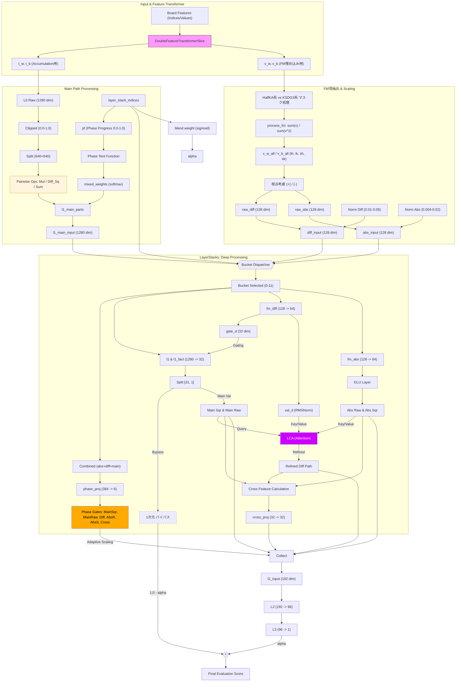

# HalfKA-KSDG3_FM_1280

- 「HalfKA-KSDG3_FM_1280」はやねうら王の「SFNNwoPSQT-1536 NNUE アーキテクチャ」を元にして、FM（Factorization Machines）的な考え方を取り入れたものです。
- FM的な考え方を取り入れるアイデアやプログラム作成（python側、C++側の両方）等について、多くの部分をGemini等（Gemini、Copilot、ChatGPT）にお手伝い頂きました。
- C++側はとりあえずは処理速度はあまり考慮していません。たぶん高速化の余地は色々とあると思います。
- 棋力的には特に強くなっていません。NPSは水匠11αの約3分の1で、ノード数固定で対局すると水匠11αと同程度、同じ持ち時間で対局すると水匠11αへの勝率20%くらいで大幅に負け越します。
- 以下のプログラムを元にして作成しました。
  - やねうら王：https://github.com/yaneurao/YaneuraOu/tree/e4589706b973847b5db834bd449122a71d72b565 （やねうら王本家）
  - nnue-pytorch：https://github.com/saihyou/nnue-pytorch/tree/7c8a0a02c42cc02a72cd2d206753430ef54f9da5 （saihyouさんのリポジトリのfeature/feature_transformerブランチ）

- NNUE評価関数の入力特徴量はHalfKPやHalfKAのように「玉と他の駒」の形が多いと思います。  
  そこで、NNUE以前の「2駒関係（KP-PPなど）」や「3駒関係（KPPTなど）」のように、「玉以外の駒同士」の関係をNNUEにもっと直接的に取り入れてみたいと考えていたのですが、  
  「[HalfKP-PP](https://github.com/tttak/YaneuraOu/releases/tag/V4.89_NNUE-features_20200401)」のように特徴量に直接PPを追加する方法だと処理速度が非常に遅くなり、うまくいかないようでした。  

- 今回の「HalfKA-KSDG3_FM_1280」では、FeatureTransformerの部分に「203670（特徴量の次元数） * 32」個のweight（Vベクトル）を追加し、  
  評価値計算の際には当該局面の特徴量に基づき「SumV = sum(weight)」と「SumV2 = sum(weight^2)」を算出し、  
  さらに「Inter = (SumV^2 - SumV2) / 2」を算出し、これをNetwork（LayerStacks）の入力に加える形にしました。  
  簡単のため変数2個だけで考えると「Inter = ((a+b)^2 - (a^2+b^2)) / 2 = ab」ということでaとbの積の形になるので  
  間接的に駒同士の相互作用が算出されたことになるとのことでした。（これがFM（Factorization Machines）的な考え方とのこと）

- 今回の入力特徴量は「HalfKAとKSDG3（KingSafety3_DistinguishGolds）」にしているのですが、  
  上記FM項の部分もHalfKA部分とKSDG3部分に分けて算出し、  
  さらにその各々について  
  　diff_Inter = 自分視点のInter - 相手視点のInter  
  　diff_SumV  = 自分視点のSumV  - 相手視点のSumV  
  　abs_Inter  = 自分視点のInter + 相手視点のInter  
  　abs_SumV   = 自分視点のSumV  + 相手視点のSumV  
  を算出して、Networkへのinputにしました。

- Networkへのinputは以下のようになります。
  - Main（従来からのFeatureTransformerのoutput）：1280次元
  - Diff：128次元
  - Abs：128次元

- Network（LayerStacks）側もGemini等のアイデアを受け、色々詰込みました。（実装も大部分をGemini等にして頂きました）  
  - Mainパス
    - L1で1280次元から32次元に変換
    - 31次元は下記Diffゲートの後、その31次元自体とそれを2乗したものをL2へ
    - 1次元は直接L3へ（バイパス）

  - Diffパス
    - L1で128次元から64次元に変換
    - 前半32次元はMainパスのGateとして使用
    - 後半32次元は以下を適用した後、L2へ
      - RMSNormを適用
      - 簡易的なLCA（Lightweight Cross-Attention）を適用
        - Query：Mainパスの31次元を使用
        - Key：Diffの32次元とAbsの32次元を使用
        - Value：Keyと同じ

  - Absパス
    - L1で128次元から64次元に変換
    - GLU（Gated Linear Unit）：前半32次元を後半32次元のGateとして使用
    - 上記Gate適用後の後半32次元と、それを2乗したものをL2へ

  - Cross Feature：異種パス間の積による相関特徴
    - 以下をあわせてL2へ
      - 「Mainパスの2乗部分の中の16次元」と「Diffパスの中の16次元」を掛け算
      - 「Mainパスの中の16次元」と「Absパスの中の16次元」を掛け算

  - 以上で作成された下記192次元のうちPad以外の6種類について、Phase Gateでスケール調整（Phase Gateの値自体も学習させる）
    - MainSqr：31次元
    - MainRaw：31次元
    - Diff：32次元
    - AbsRaw：32次元
    - AbsSqr：32次元
    - Cross：32次元
    - Pad：2次元（次元の合計を32の倍数にするために0をパディング）

  - スケール調整後の192次元をL2で96次元に変換
  - L3で96次元を1次元に変換
  - 「L3のoutputの1次元」と上記「Mainからバイパスの1次元」をブレンドして評価値として返す
    - ブレンド係数も学習させる

- LayerStacksは12個にして、「当該局面の駒割りの差の絶対値」で0～11に分類しました。  
  （この分け方についてそれほど根拠はありません。NNUEの評価値も大雑把に見れば駒割りの評価値付近にあることが多いと思うので、各々のLayerStackが各評価値帯で専門分化してくれれば、くらいに思っています）

- FeatureTransformerのMainの部分も多少変更しました。  
  「SFNNwoPSQT-1536」等でUSE_ELEMENT_WISE_MULTIPLYを有効にした場合、  
  例えばL1が1280次元の場合は640個の要素ごとの積を計算していると思いますが、  
  今回は積だけではなく「積、差の2乗、和/2」の3つを計算して、それをブレンドするようにしました。  
  ブレンド係数は「4（序盤、中盤1、中盤2、終盤の4種類） * 640（上記要素数） * 3（積、差の2乗、和/2の3種類）」個のパラメータにして学習させました。  
  （正確には「4」の部分は「序盤、中盤1、中盤2、終盤」ではなく上記のLayerStacksの0～11をもとにテント関数で算出）
  - ちなみに、Genini等によるとStockfishや「SFNNwoPSQT-1536」等で要素ごとの積を計算している時点で（FMとはまた別のところで）「駒同士の相互作用」が計算されていることになるとのことでした。  
    （今回でいえば）203670次元から1280次元への変換後に積を計算しているので入力特徴量自体の積ではないのですが、間接的に「駒同士の相互作用」ということになるとのことでした。

- 特徴量の中の「KSDG3」は下記リンク先の「KingSafety Distinguish Golds」と概ね同じですが、  
  玉の24近傍のうち盤外は特徴量に含めないようにしました。  
  （なので局面ごとの特徴量の数は一定ではなく、玉の位置によって8個～24個に変わります）  
  https://github.com/tttak/YaneuraOu/releases/tag/V4.89_NNUE-features_20200406

- 今回はC++側（YaneuraOu側）はあまりきちんと整合をとった改修はしておらず、  
  AVX2用の実行ファイルは問題なく動くと思いますが、  
  例えばSSE42用の実行ファイルはSSE42環境では動作しないかもしれません。

- pytorchでの学習時の引数をいくつか追加しました。  
  例：
  ```
  python train.py --offset1 270 --offset2 270 --in-scaling 340 --out-scaling 380 --batch-size 16384 --threads 2 --num-workers 8 --gpus 1 --log_every_n_steps 50 --features="HalfKA_KSDG3" --lr=1e-4 --start-lambda 1.0 --end-lambda 1.0 --max_epochs 3000 --epoch-size 50000000 --network-save-period 5 --seed 100 --mirror 0.05 --train1-rate 0.50 --train2-rate 0.30 --skiprate 3.0 C:\xxx\train1.bin C:\xxx\train2.bin C:\xxx\train3.bin C:\xxx\validation.bin
  ```
  - --offset1、--offset2：元々の--offsetを現在のネットからの出力用（--offset1）と教師局面用（--offset2）の2つに分けました。（たぶんあまり意味はないです）
  - --mirror：教師局面の左右反転率。例えば「--mirror 0.05」の場合、教師局面の5%を左右反転して使います。
  - --train1-rate、--train2-rate：教師局面のbinファイルを3つ指定し、各々の割合を指定します。例えば「--train1-rate 0.50 --train2-rate 0.30」の場合、train1.binから50%、train2.binから30%、train3.binから20%の局面が使われます。
  - --skiprate：例えば「--skiprate 3.0」の場合、教師局面をバッチサイズの3倍読み込んだうえで、バッチサイズ分をランダムに選んで使います。

- 学習時に500ステップごとに色々とログ出力するようにしました。（下記「学習ログの例」参照）
  - これも大部分のコードをGemini等に作成して頂きました。
  - ログをそのまま貼り付けるだけでGemini等が様々なアドバイスをしてくれると思います。
  - 例えば、ゼロからの学習時にはログの「G_Ratio」がかなり小さな値になると思います。  
    これは今回追加したFM部に勾配が流れていっていないことを意味するのですが、G_Ratio向上のために初期値変更や係数変更、部分的な学習率の変更やネットワークの構造変更など、色々なアドバイスを頂きました。  
    最初の1～2epochだけself.input.weightとself.input.biasの学習率をゼロにして強制的にself.input.vの方に勾配を流し、その後通常に戻す方法が一番効果があったかもしれません。
  - TensorBoardに出力する情報もいくつか追加しました。
    - DiffとAbsのGate率の推移
    - 上記「積、差の2乗、和/2」の混合率の推移
    - 学習率の推移
    - lambda（評価値と勝敗の混合率）の値を仮に0.0, 0.5, 1.0等にしたときのval_lossの推移（実際のlambdaの値とは関係なく）

- 学習コマンドの例（nnue-pytorch）
  ```
  # ゼロから学習
  python train.py --offset1 270 --offset2 270 --in-scaling 340 --out-scaling 380 --batch-size 16384 --threads 2 --num-workers 8 --gpus 1 --log_every_n_steps 50 --features="HalfKA_KSDG3" --lr=1e-4 --start-lambda 1.0 --end-lambda 1.0 --max_epochs 3000 --epoch-size 50000000 --network-save-period 5 --seed 100 --mirror 0.05 --train1-rate 0.50 --train2-rate 0.30 --skiprate 3.0 C:\xxx\train1.bin C:\xxx\train2.bin C:\xxx\train3.bin C:\xxx\validation.bin

  # ckptから学習再開
  python train.py --resume-from-model logs\lightning_logs\version_5\100.ckpt --offset1 270 --offset2 270 --in-scaling 340 --out-scaling 380 --batch-size 16384 --threads 2 --num-workers 8 --gpus 1 --log_every_n_steps 50 --features="HalfKA_KSDG3" --lr=1e-4 --start-lambda 1.0 --end-lambda 1.0 --max_epochs 3000 --epoch-size 50000000 --network-save-period 5 --seed 100 --mirror 0.05 --train1-rate 0.50 --train2-rate 0.30 --skiprate 3.0 C:\xxx\train1.bin C:\xxx\train2.bin C:\xxx\train3.bin C:\xxx\validation.bin

  # ptから学習再開
  python train.py --resume-from-model C:\yyy\nn.pt --offset1 270 --offset2 270 --in-scaling 340 --out-scaling 380 --batch-size 16384 --threads 2 --num-workers 8 --gpus 1 --log_every_n_steps 50 --features="HalfKA_KSDG3" --lr=1e-4 --start-lambda 1.0 --end-lambda 1.0 --max_epochs 3000 --epoch-size 50000000 --network-save-period 5 --seed 100 --mirror 0.05 --train1-rate 0.50 --train2-rate 0.30 --skiprate 3.0 C:\xxx\train1.bin C:\xxx\train2.bin C:\xxx\train3.bin C:\xxx\validation.bin

  # 「--features="HalfKA_KSDG3^"」で学習する場合
  python train.py --offset1 270 --offset2 270 --in-scaling 340 --out-scaling 380 --batch-size 16384 --threads 2 --num-workers 8 --gpus 1 --log_every_n_steps 50 --features="HalfKA_KSDG3^" --lr=1e-4 --start-lambda 1.0 --end-lambda 1.0 --max_epochs 3000 --epoch-size 50000000 --network-save-period 5 --seed 100 --mirror 0.05 --train1-rate 0.50 --train2-rate 0.30 --skiprate 3.0 C:\xxx\train1.bin C:\xxx\train2.bin C:\xxx\train3.bin C:\xxx\validation.bin

  # nn.nnue（nn.bin）作成
  python serialize.py --ft_compression none logs\lightning_logs\version_0\5.ckpt C:\yyy\nn.nnue --features="HalfKA_KSDG3"

  # nn.nnue（nn.bin）作成（「--features="HalfKA_KSDG3^"」で学習した場合）
  python serialize.py --ft_compression none logs\lightning_logs\version_0\5.ckpt C:\yyy\nn.nnue --features="HalfKA_KSDG3^"

  # pt作成
  python serialize.py --ft_compression none C:\yyy\nn.nnue C:\yyy\nn.pt --features="HalfKA_KSDG3"

  # tensorboard起動
  tensorboard --logdir=lightning_logs/
  ```

- ビルドコマンドの例（YaneuraOu）
  ```
  make -j8 tournament TARGET_CPU=AVX2 COMPILER=clang++ YANEURAOU_EDITION=YANEURAOU_ENGINE_NNUE_SFNNwoP1536 EXTRA_CPPFLAGS="-DUSE_ELEMENT_WISE_MULTIPLY"
  ```

- その他
  - GPUメモリ節約と学習速度向上のためオプティマイザにはAdamW8bitを使用していますが、たぶんその分精度は落ちていると思います。
  - 教師局面を事前にqsearchでフィルタするのが面倒なときのために、簡易的に「手番側が相手側の駒（ただし歩と香と桂を除く）をただで取れる局面」の場合はスキップするようにしていますが、たぶん素直にqsearchでフィルタした方がよいと思います。

- HalfKA-KSDG3_FM_1280 アーキテクチャ図（Gemini作成）



- 学習ログの例
```
[FM Detailed Debug Step 344000]
 Features   | ActiveAvg: 55.8, Unique:47309
 LayerStacks Entry Analysis
   MainPath | mean: 0.0279, std: 0.0738, min: 0.0000, max: 0.8593
   FM Diff  | mean: 0.5012, std: 0.2553, min: 0.0000, max: 1.0000
   FM Abs   | mean: 0.4951, std: 0.2609, min: 0.0000, max: 1.0000
 Output Composition | L3(Deep):  1.0998 (72.8%) | MainBypass:  0.4113 (27.2%)
 Final Score Range  | Min:   -6.80, Max:    9.13, Mean:   -0.10
 Blend Alpha (DeepPath Ratio):
   Mean : 40.97%
   Min  : 36.84%
   Max  : 55.81%
--------------------------------------------------------------------------------------------------------------
FM Component        | Raw min / mean  / max    / std    |   Zero% |   High%
--------------------------------------------------------------------------------------------------------------
 Inter HalfKA(Diff) |  0.000 /  0.522 /  1.000 /  0.352 |  18.34% |  22.34%
 Inter HalfKA(Abs)  |  0.214 /  0.756 /  1.000 /  0.245 |   0.00% |  44.55%
 Inter KSDG3(Diff)  |  0.000 /  0.497 /  1.000 /  0.167 |   2.34% |   2.06%
 Inter KSDG3(Abs)   |  0.299 /  0.540 /  1.000 /  0.106 |   0.00% |   3.15%
 SumV HalfKA(Diff)  |  0.000 /  0.478 /  1.000 /  0.261 |   7.80% |   5.52%
 SumV HalfKA(Abs)   |  0.000 /  0.234 /  1.000 /  0.214 |  33.79% |   0.00%
 SumV KSDG3(Diff)   |  0.000 /  0.508 /  1.000 /  0.201 |   1.38% |   2.04%
 SumV KSDG3(Abs)    |  0.000 /  0.451 /  1.000 /  0.123 |   3.12% |   0.00%
-------------------------------------------------------------------------------------------------------------------
Component                              |    Min /   Mean /    Max /    Std
-------------------------------------------------------------------------------------------------------------------
 FM Diff (RMSNormed, before scaling)   |  -3.46 /  -0.38 /   2.89 /   0.93
 FM Abs  (Gated, before scaling)       | -82.71 / -18.26 /  17.99 /  17.22
--------------------------------------------------------------------------------------------------------------
[Signal Strength (L2 Input)]
 L2 In | Main(Sqr): 0.1491 | Main(Raw): 0.2382 | FM(Diff): 0.2047 | FM(Abs): 0.0862  | cross_feat: 0.0956
--------------------------------------------------------------------------------------------------------------
Section      |    Mean | AbsMean |     Std |     Max |     Min |   Zero% |   High%
--------------------------------------------------------------------------------------------------------------
Main(Sqr)    |   0.149 |   0.149 |   0.245 |    1.00 |    0.00 |   40.8% |    3.2%
Main(Raw)    |   0.238 |   0.238 |   0.255 |    1.00 |    0.00 |   32.1% |    0.5%
FM(Diff)     |   0.205 |   0.205 |   0.117 |    0.75 |    0.00 |    1.0% |    0.0%
FM(Abs_Raw)  |   0.105 |   0.105 |   0.122 |    0.64 |    0.00 |   52.0% |    0.0%
FM(Abs_Sqr)  |   0.068 |   0.068 |   0.089 |    0.76 |    0.00 |   53.7% |    0.0%
cross_feat   |   0.096 |   0.096 |   0.153 |    1.00 |    0.00 |   49.2% |    0.1%
[Gradient] MeanAbs_V:1.16e-08, MeanAbs_M:5.99e-08, G_Ratio:  0.1897
[Weights]  Diff_W:180.40, Abs_W:167.68, L2_W:105.44
------------------------------------------------------------------------------------------------------------------------
Layer Name         | Grad Mean    Active   | W_Mean   W_Min    W_Max     W_Std   | B_Mean   B_Min    B_Max     B_Std
------------------------------------------------------------------------------------------------------------------------
W_input (All)      | 0.0000005371 29647581 | -0.00738 -3.12267 +3.61843  0.12681 | -0.33700 -5.61275 +5.45901  1.61380
W_KSDG3 (Part)     | 0.0000011853 2879718  | -0.02351 -3.12267 +3.61843  0.11047 | -0.33700 -5.61275 +5.45901  1.61380
W_HalfKA (Part)    | 0.0000004637 26767863 | -0.00631 -3.01776 +3.27143  0.12775 | -0.33700 -5.61275 +5.45901  1.61380
V_Factor (FM)      | 0.0000001101 1805659  | -0.26832 -11.84785 +9.91828  0.82188 | +0.00000 +0.00000 +0.00000  0.00000
Pair_W (Raw)       | 0.0000022211 7680     | -1.15349 -2.31462 -0.32564  0.33184 | +0.00000 +0.00000 +0.00000  0.00000
L1_Main (Linear)   | 0.0000029863 491366   | +0.00497 -1.99523 +1.97547  0.16674 | +0.38679 -0.21461 +1.05170  0.23155
L1_Fact            | 0.0000103760 40960    | -0.00009 -0.03683 +0.04975  0.00335 | +0.00087 -0.01044 +0.00437  0.00298
FM_Diff_Path       | 0.0000011840 98304    | -0.00980 -1.98438 +1.98438  0.57531 | -0.98626 -3.23673 +1.10206  1.07939
FM_Abs_Path        | 0.0000004325 44396    | -0.15412 -1.98438 +1.98438  0.51211 | -1.21618 -2.26590 +0.90598  0.73463
cross_proj         | 0.0000028191 8902     | -0.01314 -1.99517 +1.99119  0.38683 | +0.02138 -0.44912 +0.50151  0.14018
q_proj             | 0.0000088521 992      | -0.00187 -0.69049 +0.73741  0.17914 | +0.00172 -0.39700 +0.37102  0.21550
k_proj             | 0.0000070785 2048     | -0.00067 -0.92111 +0.73578  0.20900 | -0.05575 -0.29001 +0.27845  0.15033
v_proj             | 0.0000029071 1685     | -0.05918 -0.72170 +1.98144  0.22099 | -0.21359 -0.42911 +0.05303  0.14075
phase_proj         | 0.0000250930 2238     | -0.00819 -0.81542 +0.62691  0.09053 | -0.03335 -0.08950 -0.00053  0.03964
L2_Weight (Sum)    | 0.0000019016 171379   | -0.00105 -1.98438 +1.98008  0.22419 | +0.17184 -1.85856 +1.38721  0.19198
Output_Weight      | 0.0000301112 1114     | -0.00093 -1.66893 +1.66258  0.47391 | +0.08176 +0.00681 +0.27138  0.06922
P_Open_Mul         | 0.0000025231 640      | +0.48282 +0.15697 +0.71722  0.07539 | +0.00000 +0.00000 +0.00000  0.00000
P_Open_Diff        | 0.0000018775 640      | +0.27180 +0.18216 +0.55031  0.04656 | +0.00000 +0.00000 +0.00000  0.00000
P_Open_Sum         | 0.0000010975 640      | +0.24538 +0.10062 +0.58192  0.07207 | +0.00000 +0.00000 +0.00000  0.00000
P_Mid1_Mul         | 0.0000033557 640      | +0.47084 +0.14130 +0.59180  0.06859 | +0.00000 +0.00000 +0.00000  0.00000
P_Mid1_Diff        | 0.0000024325 640      | +0.26064 +0.12702 +0.51800  0.04238 | +0.00000 +0.00000 +0.00000  0.00000
P_Mid1_Sum         | 0.0000015362 640      | +0.26852 +0.13065 +0.65636  0.06903 | +0.00000 +0.00000 +0.00000  0.00000
P_Mid2_Mul         | 0.0000035417 640      | +0.44602 +0.10986 +0.56161  0.07149 | +0.00000 +0.00000 +0.00000  0.00000
P_Mid2_Diff        | 0.0000026479 640      | +0.25486 +0.10603 +0.61141  0.04508 | +0.00000 +0.00000 +0.00000  0.00000
P_Mid2_Sum         | 0.0000014628 640      | +0.29912 +0.16227 +0.68691  0.07394 | +0.00000 +0.00000 +0.00000  0.00000
P_End _Mul         | 0.0000019685 640      | +0.42546 +0.09921 +0.58260  0.07715 | +0.00000 +0.00000 +0.00000  0.00000
P_End _Diff        | 0.0000014610 640      | +0.24798 +0.13393 +0.58981  0.04161 | +0.00000 +0.00000 +0.00000  0.00000
P_End _Sum         | 0.0000009273 640      | +0.32656 +0.17262 +0.67778  0.08290 | +0.00000 +0.00000 +0.00000  0.00000
------------------------------------------------------------------------------------------------------------------------
[Attention Status] dynamic_scale (FM-Filter)
  Mean: 0.3559 | Min: 0.0106 | Max: 0.9866 | Std: 0.2503
  Distribution: Low(<0.2): 32.2% | High(>0.8): 8.5%
  Current Temp (T) : 0.1559
[LCA Meta-Learning]
  Current Temp (T) : 0.1559
  Temp Grad        : +6.77e-04 [Sharper(0/1) ↓]
[Blend Strategy Detailed]
  - Mul  | Avg: 45.6% | Std: 0.076 | Range: [9.9% - 71.7%]
  - Diff | Avg: 25.9% | Std: 0.045 | Range: [10.6% - 61.1%]
  - Sum  | Avg: 28.5% | Std: 0.081 | Range: [10.1% - 68.7%]
  Phase Open Mix Ratio -> Mul: 0.483, Diff: 0.272, Sum: 0.245
  Phase Mid1 Mix Ratio -> Mul: 0.471, Diff: 0.261, Sum: 0.269
  Phase Mid2 Mix Ratio -> Mul: 0.446, Diff: 0.255, Sum: 0.299
  Phase End  Mix Ratio -> Mul: 0.425, Diff: 0.248, Sum: 0.327
-------------------------------------------------------------------------------------------------------------------
Layer (Bucket)         | Grad Mean    Active   | W_Mean   W_Min    W_Max     W_Std   | B_Mean
-------------------------------------------------------------------------------------------------------------------
FM_Diff_Gate(B0)       | 0.0000023568 4096     | +0.02066 -1.97998 +1.98438  0.39392 | -2.04689
FM_Diff_Val (B0)       | 0.0000007061 4096     | -0.01684 -1.98437 +1.98437  0.70293 | +0.04713
FM_Abs_Gate(B0)        | 0.0000008822 1664     | +0.09247 -1.98438 +1.98438  0.46018 | -1.78863
FM_Abs_Val (B0)        | 0.0000001105 1664     | -0.41555 -1.98437 +1.60982  0.48399 | -0.71319
-------------------------------------------------------------------------------------------------------------------
FM_Diff_Gate(B11)      | 0.0000015662 4096     | -0.00120 -1.94373 +1.63836  0.37094 | -1.92440
FM_Diff_Val (B11)      | 0.0000004208 4096     | -0.02034 -1.98437 +1.98420  0.72587 | +0.07691
FM_Abs_Gate(B11)       | 0.0000008390 3723     | +0.00992 -1.98438 +1.98438  0.52980 | -1.86520
FM_Abs_Val (B11)       | 0.0000004090 3723     | -0.47771 -1.98438 +1.98437  0.59184 | -0.72803
-------------------------------------------------------------------------------------------------------------------
--- Inter-Gating Status (Effective) ---
Abs (Filtered by Abs-Gate) Open: 55.33% (sharp:0.167)
Main (Filtered by Diff-Gate) Open: 65.15% (sharp:0.102)
--- 6-Channel Phase Gate Status (Adaptive Control) ---
Name     | Mean  | Std   | Range       | Low%  | High%
--------------------------------------------------------------
MainSqr  | 0.589 | 0.171 | [0.12-0.96] |  0.4% |  12.6%
MainRaw  | 0.236 | 0.132 | [0.10-0.71] | 57.3% |   0.0%
FM_Diff  | 0.310 | 0.108 | [0.11-0.93] | 10.3% |   0.1%
FM_AbsR  | 0.315 | 0.156 | [0.10-0.97] | 23.5% |   1.0%
FM_AbsS  | 0.307 | 0.105 | [0.11-0.98] |  8.0% |   0.2%
Cross    | 0.392 | 0.111 | [0.13-0.82] |  2.6% |   0.0%
[Bucket-wise FM Value & Gate Analysis]
--------------------------------------------------------------------------------------------------------------
B_ID | Samples% | Eval(cp)  | L1_Main  | FM_Diff_V    | FM_Abs_V     | AbsOpen(GatebyAbs)% | MainOpen(GatebyDiff)% | L2_Layer | L3(Deep)% | Blend(Alpha)%
--------------------------------------------------------------------------------------------------------------
B00 |  20.0% |  +20.3( 267.4) | 0.134 | 0.538|5.3e-07 | 0.499|3.6e-08 |  51.1% |  67.8% | 0.150   |  78.8% |  55.8%
B01 |   4.0% |  +70.7( 602.1) | 0.122 | 0.551|1.7e-07 | 0.545|4.6e-10 |  83.0% |  64.7% | 0.145   |  76.3% |  37.1%
B02 |  12.4% |   +4.7( 447.0) | 0.123 | 0.504|4.9e-07 | 0.478|7.4e-08 |  55.7% |  65.2% | 0.161   |  81.3% |  49.0%
B03 |   3.7% |  +51.6( 630.0) | 0.118 | 0.562|3.0e-07 | 0.466|2.8e-08 |  77.1% |  65.2% | 0.150   |  76.7% |  37.7%
B04 |   5.5% |  +40.6( 552.2) | 0.119 | 0.557|2.6e-07 | 0.433|3.5e-08 |  85.7% |  67.9% | 0.153   |  77.9% |  38.5%
B05 |   7.5% |   +6.5( 663.3) | 0.110 | 0.588|2.9e-07 | 0.574|3.0e-08 |  63.0% |  64.3% | 0.157   |  75.4% |  39.0%
B06 |   5.8% |   +2.7( 723.9) | 0.108 | 0.568|5.3e-07 | 0.493|4.0e-08 |  61.5% |  66.4% | 0.160   |  76.4% |  36.8%
B07 |   6.7% |  -23.4( 803.1) | 0.106 | 0.590|4.1e-07 | 0.518|3.7e-08 |  52.7% |  64.3% | 0.164   |  75.0% |  40.8%
B08 |   5.6% |   +6.2( 936.6) | 0.103 | 0.587|3.4e-07 | 0.509|1.2e-07 |  66.8% |  65.1% | 0.157   |  72.8% |  37.0%
B09 |   6.2% |  -29.5(1057.6) | 0.097 | 0.598|2.8e-07 | 0.508|1.3e-07 |  41.2% |  65.4% | 0.155   |  72.1% |  37.2%
B10 |   5.8% |  +27.5(1300.8) | 0.093 | 0.578|2.2e-07 | 0.447|9.8e-08 |  42.5% |  67.7% | 0.161   |  71.9% |  36.9%
B11 |  16.6% | -412.1(2215.0) | 0.090 | 0.568|3.3e-07 | 0.621|1.4e-07 |  39.6% |  60.4% | 0.160   |  68.8% |  45.7%
--------------------------------------------------------------------------------------------------------------

[Bucket-wise Phase Gate Analysis (6-Channel)]
--------------------------------------------------------------------------------------------------------------
B_ID | MSqr  | MRaw  | Diff  | AbsR  | AbsS  | Cross | Low%  | High%  | Samples% | AttScore(mean/std) | Loss
--------------------------------------------------------------------------------------------------------------
B00  | 0.724 | 0.415 | 0.286 | 0.254 | 0.249 | 0.449 |  7.6% |   6.6% |    20.0% | 0.300 / 0.163 | 0.00727
B01  | 0.581 | 0.185 | 0.319 | 0.369 | 0.308 | 0.383 | 15.3% |   0.8% |     4.0% | 0.458 / 0.191 | 0.01926
B02  | 0.636 | 0.289 | 0.287 | 0.297 | 0.266 | 0.394 |  9.6% |   3.1% |    12.4% | 0.358 / 0.184 | 0.01386
B03  | 0.568 | 0.181 | 0.316 | 0.356 | 0.307 | 0.373 | 16.1% |   0.6% |     3.7% | 0.417 / 0.202 | 0.01991
B04  | 0.575 | 0.210 | 0.296 | 0.329 | 0.290 | 0.365 | 13.6% |   1.0% |     5.5% | 0.387 / 0.210 | 0.01756
B05  | 0.558 | 0.180 | 0.310 | 0.351 | 0.309 | 0.370 | 17.1% |   0.6% |     7.5% | 0.383 / 0.221 | 0.01963
B06  | 0.535 | 0.177 | 0.309 | 0.342 | 0.310 | 0.356 | 18.0% |   0.4% |     5.8% | 0.346 / 0.210 | 0.01963
B07  | 0.531 | 0.175 | 0.310 | 0.338 | 0.317 | 0.359 | 19.1% |   0.3% |     6.7% | 0.335 / 0.233 | 0.01883
B08  | 0.514 | 0.161 | 0.310 | 0.337 | 0.336 | 0.357 | 21.4% |   0.4% |     5.6% | 0.415 / 0.282 | 0.01907
B09  | 0.504 | 0.161 | 0.314 | 0.339 | 0.336 | 0.352 | 22.3% |   0.4% |     6.2% | 0.374 / 0.277 | 0.01734
B10  | 0.509 | 0.162 | 0.312 | 0.335 | 0.338 | 0.362 | 24.7% |   0.4% |     5.8% | 0.381 / 0.301 | 0.01544
B11  | 0.546 | 0.163 | 0.355 | 0.314 | 0.375 | 0.409 | 28.3% |   2.1% |    16.6% | 0.335 / 0.362 | 0.00650
--------------------------------------------------------------------------------------------------------------
Epoch 112:  86%|██████████████████████████████████████████▉       | 2675/3114 [08:11<01:20,  5.45it/s, loss=0.0093, v_num=2]
```

